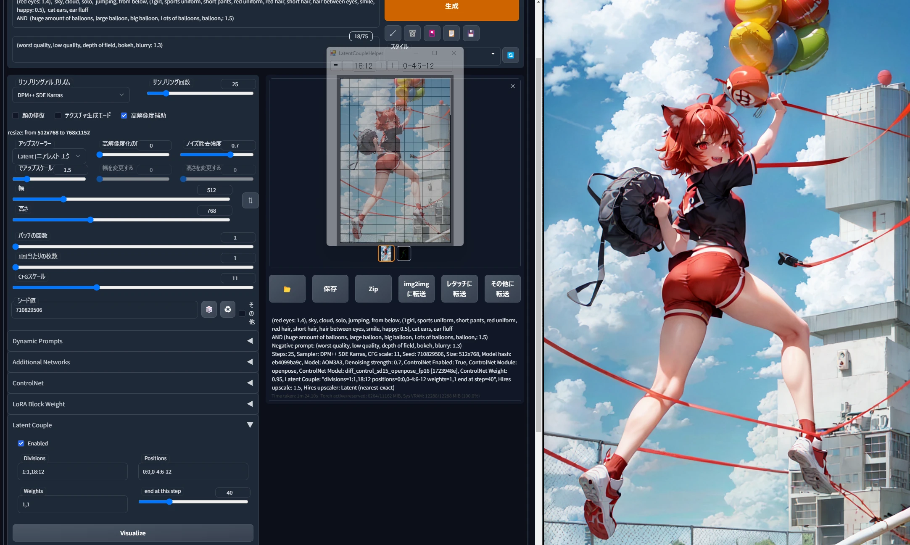
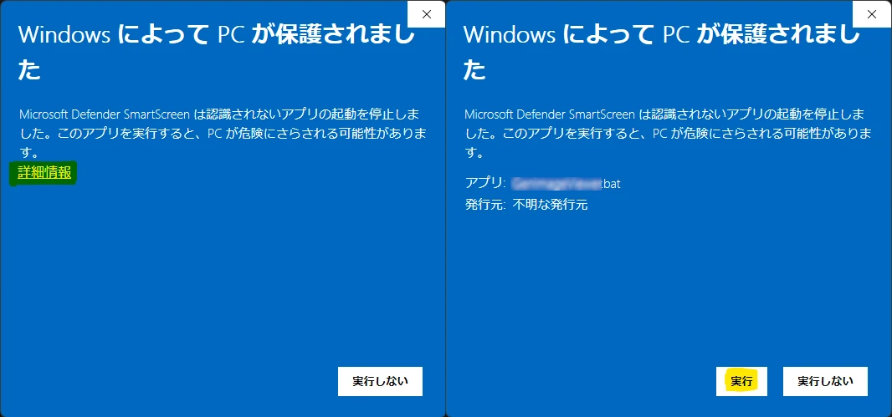
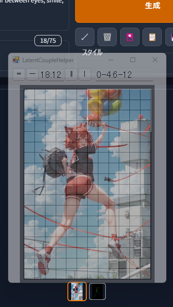

# LatentCoupleHelper README

This tool is language-independent. Please translate this page in your browser.

Stable Diffusion web UI の Latent Couple 拡張で、好きな位置にプロンプトを置くためのツールです。
スクリプトなので中身が見えて、安心です。

----
「画面を分割しているようじゃダメだな」 
「ん？そー思わんか？」

「プロンプトを!」 
「置いてくる!!!」

----

## 使い方

Windows で LatentCoupleHelper.bat と LatentCoupleHelper.ps1 があれば動作します。

- LatentCoupleHelper.bat をダブルクリックすると LatentCoupleHelper が立ち上がります。
	- 初回起動時に警告が表示された場合は「詳細情報」>「実行」します。 
- 参考にしたい画像のサイズに合うように、ウィンドウを移動してリサイズします。 
- 「═」「─」ボタンで縦の分割数を、「║」「│」ボタンで横の分割数を増減できます。
	- ボタンの間にある縦横分割数のテキストボックスをクリックすると、分割数を自動でクリップボードにコピーします。
		- 分割数を Latent Couple の「Divisions」に貼り付けます。
- 真ん中のエリアを左ドラッグすると、領域を選択できます。
	- 右上のテキストボックスをクリックすると、選択した領域を自動でクリップボードにコピーします。
		- 選択した領域を Latent Couple の「Positions」に貼り付けます。
- Latent Couple の「Weight」を追加し、AND でプロンプトを追記すると、選択した領域に AND のプロンプトを置いた絵を生成できます。
	- 上の画像を参考にしてください。

## 他のツール

- [GenImageViewer](https://github.com/Zuntan03/GenImageViewer)
	- Stable Diffusion web UI が生成した画像を、自動で大きく表示するツールです。タイトル画像右側の表示が、画像の生成に合わせて自動で更新されます。
- [MaiNovel](https://github.com/Zuntan03/MaiNovel)
	- AI で生成した音声と画像で、ビジュアルノベルを作るツールです。

## ライセンス

[MIT License](./LICENSE.txt) です。

This software is released under the MIT License, see [LICENSE.txt](./LICENSE.txt).
